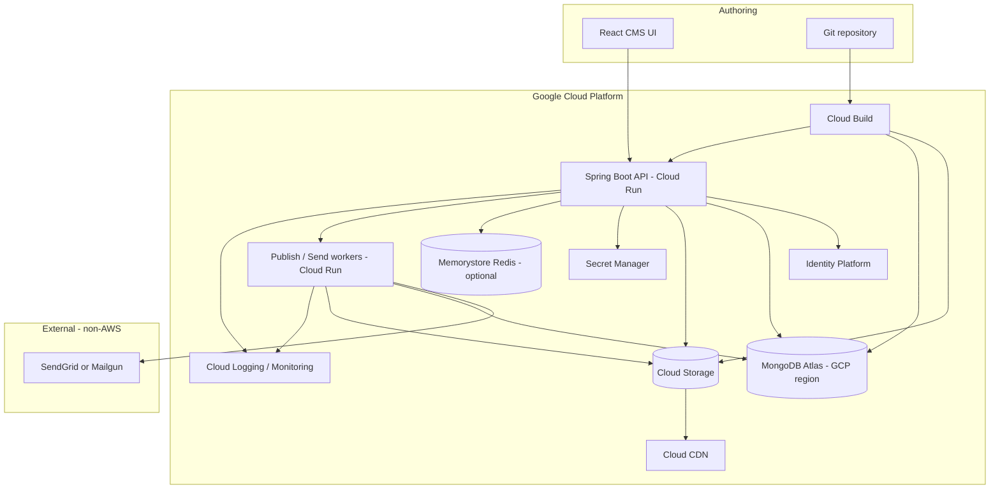
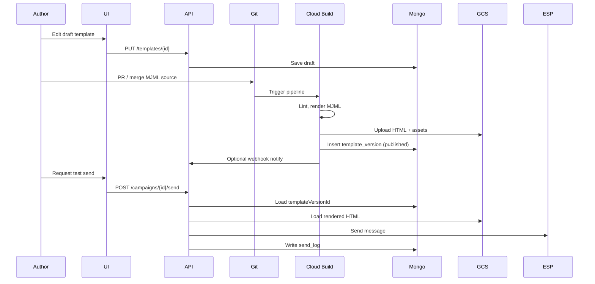

# OmniMail CMS — Solution Architecture

**Version:** 0.1 (draft for review)  
**Status:** Planning  
**Cloud:** Google Cloud Platform only (no AWS services or SDKs)

---

## 1. Purpose

OmniMail CMS manages **email campaign templates and assets** with:

- Versioning and immutable published artifacts
- Review and approval **workflows**
- **Authentication** and role-based access
- **UI** and **API** to create, retrieve, and update content in the document store
- **On-demand send** of rendered email for a specific template version
- Storage optimized for **GCS** (large assets) and **MongoDB** (semi-structured template/campaign data)

The system is designed to run entirely on **GCP** today, while keeping a **portable core** (domain logic + interfaces) so adapters can be swapped for another cloud later if required.

---

## 2. Scope

### In scope

- Template and campaign **CRUD** (draft and published)
- **Asset upload** with content-addressed storage (SHA-256 keys)
- **Workflow** states: draft → in review → approved → publishing → published (and failure/rejection paths)
- **Versioning**: Git for source; immutable `templateVersionId` in MongoDB + GCS for runtime
- **Publish pipeline** via Cloud Build (lint, render MJML, upload artifacts)
- **Send API** resolving a published version and dispatching via SendGrid/Mailgun
- **Multi-tenant** readiness via `tenantId` on all persisted entities
- **Audit** trails for workflow and send operations

### Out of scope (initial releases)

- Full marketing automation (journeys, A/B at scale, list management)
- Built-in ESP list hygiene / bounce processing (delegate to ESP)
- Native GCP bulk email product (none exists equivalent to campaign-scale SES; use external ESP)

---

## 3. High-level architecture



### Layered storage model

| Layer | Component | What is stored | Why |
|-------|-----------|----------------|-----|
| **A. Source of truth** | Git (Cloud Source Repositories or GitHub connected to Cloud Build) | MJML/HTML source, shared components, config | Auditability, branching, code review |
| **B. Runtime documents** | MongoDB Atlas (GCP region) | Version metadata, campaign docs, workflow state, variable schemas | Flexible schema for semi-structured email content |
| **C. Large blobs** | GCS + Cloud CDN | Rendered HTML, images, PDFs | Cost and performance; email clients fetch assets at open time |

**Rule:** Do not store large binaries in MongoDB. Store **logical object keys** and metadata only.

---

## 4. Data flow

| Stage | Storage | Action |
|-------|---------|--------|
| **Authoring** | Git + UI (drafts in MongoDB) | Marketers/devs edit; UI saves drafts; Git holds canonical source for production |
| **Validation + publish** | Cloud Build | Lint MJML/HTML, render, security checks, upload to GCS, insert immutable version in MongoDB |
| **Drafting / iteration** | MongoDB | Campaign references `templateVersionId`; new versions do not mutate published rows |
| **Assets** | GCS + CDN | Content-addressed keys; CDN serves images at open time |
| **Send** | API/Worker | Load version by ID, personalize, call ESP |



---

## 5. Technology stack (GCP)

| Concern | Choice | Notes |
|---------|--------|-------|
| **API** | Java 21, Spring Boot 3 | Cloud Run container |
| **UI** | React + Vite | Firebase Hosting or GCS static + Cloud CDN |
| **Documents** | MongoDB Atlas | GCP region; not Firestore (portability) |
| **Blobs** | GCS | `google-cloud-storage` Java library |
| **CDN** | Cloud CDN | Public asset bucket or signed URLs |
| **Auth** | Identity Platform | OIDC; JWT validation in Spring Security |
| **Secrets** | Secret Manager | ESP API keys, DB URI |
| **CI/CD** | Cloud Build | Publish pipeline; triggers on Git push/PR |
| **Cache** | Memorystore (Redis) | Optional hot metadata for active campaigns |
| **Observability** | Cloud Logging, Cloud Monitoring, Cloud Trace | Standard GCP ops |
| **Email** | SendGrid or Mailgun | HTTP API; not Amazon SES |
| **Local dev** | fake-gcs-server + MongoDB Docker | No AWS/MinIO in production path |

---

## 6. Portability strategy

GCP is the **deployment target**; portability is preserved by **ports and adapters**.

### Ports (interfaces in application layer)

| Port | GCP adapter (today) | Possible future adapter |
|------|---------------------|-------------------------|
| `BlobStore` | `GcsBlobStore` | S3, Azure Blob |
| `TemplateRepository` | `MongoTemplateRepository` | Same (Atlas on another region/cloud) |
| `EmailSender` | `SendGridEmailSender` | Mailgun, SMTP |
| `SecretProvider` | `GcpSecretManagerProvider` | AWS Secrets Manager, Azure Key Vault |
| `AuthValidator` | Identity Platform JWT | Auth0, Cognito, Azure AD B2C |

### Practices

1. No `google-cloud-*` imports in domain or REST controllers — only under `infrastructure/gcp/`.
2. Persist **logical keys** (`assets/sha256/{hash}`), not `gs://` URLs, in MongoDB.
3. Build public URLs from config: `CDN_BASE_URL + objectKey`.
4. Keep CI steps **cloud-neutral** (Maven, MJML CLI); Cloud Build invokes them.
5. Use **OIDC** standard tokens so IdP can be replaced.
6. **Contract tests** for `BlobStore` against fake-gcs-server.

### Portability estimate

| Component | Effort to move |
|-----------|----------------|
| Cloud Run container | Low — redeploy to ECS/K8s/Azure Container Apps |
| GCS + CDN | Medium — new `BlobStore` + DNS (1–2 weeks) |
| Identity Platform | Medium — new IdP, same OIDC middleware |
| MongoDB Atlas | Low — change connection / region |
| Cloud Build | Low — equivalent pipeline elsewhere |
| Firestore (if chosen) | **High** — avoid for portability |

---

## 7. Domain model

### 7.1 Core entities

**Template** — logical grouping (e.g. `newsletter`).

**TemplateVersion** — immutable published (or draft) snapshot.

**Campaign** — send context: subject, from, variables, references one `templateVersionId`.

**Asset** — binary metadata + content hash.

**WorkflowEvent** — audit entry for state transitions.

**SendLog** — record of send requests for compliance.

### 7.2 TemplateVersion (published example)

```json
{
  "templateVersionId": "tpl_newsletter_v12",
  "tenantId": "org_acme",
  "templateId": "newsletter",
  "version": 12,
  "status": "published",
  "gitRef": "abc123def456",
  "sourcePath": "templates/newsletter/template.mjml",
  "htmlObjectKey": "templates/newsletter/v12/rendered.html",
  "variablesSchema": {
    "firstName": { "type": "string", "required": true },
    "ctaUrl": { "type": "url", "required": true }
  },
  "assetRefs": ["sha256:abc...", "sha256:def..."],
  "publishedAt": "2026-05-15T10:00:00Z",
  "publishedBy": "cloud-build-run-42"
}
```

### 7.3 GCS key layout

```text
{tenantId}/assets/sha256/{hash}                           # deduplicated binary
{tenantId}/templates/{templateId}/v{version}/rendered.html
{tenantId}/templates/{templateId}/v{version}/preview.png  # optional
```

### 7.4 MongoDB collections

| Collection | Purpose |
|------------|---------|
| `templates` | Logical template id, name, tags, `tenantId` |
| `template_versions` | Immutable version documents |
| `campaigns` | Campaign metadata and `templateVersionId` |
| `assets` | Hash, `objectKey`, mime, size, `tenantId` |
| `workflow_events` | State transition audit |
| `send_logs` | Send audit trail |

All queries **filter by `tenantId`** for isolation.

---

## 8. Workflow

### 8.1 States

```text
draft → in_review → approved → publishing → published
         ↓              ↓           ↓
      rejected        rejected    failed → (retry → publishing)
```

### 8.2 Roles (RBAC)

| Role | Permissions |
|------|-------------|
| `viewer` | Read templates, campaigns, previews |
| `editor` | Create/update drafts, upload assets, submit for review |
| `reviewer` | Approve/reject in-review items |
| `publisher` | Trigger publish (or merge to publish branch) |
| `admin` | Tenant config, user role assignment |

Enforced in Spring Security; workflow transitions validate role + current state.

### 8.3 UI publish vs Git publish

Both paths MUST invoke the **same** Cloud Build publish definition:

- **Git:** merge to `main` / tag → trigger pipeline.
- **UI:** “Publish” on approved template → webhook / Pub/Sub → same pipeline.

Avoid duplicate publish logic in the API.

---

## 9. API surface (planned)

Base path: `/api/v1`  
Auth: `Authorization: Bearer <JWT>` (Identity Platform)

### Templates

| Method | Path | Description |
|--------|------|-------------|
| `POST` | `/templates` | Create draft template |
| `GET` | `/templates` | List templates (`tenantId` from token) |
| `GET` | `/templates/{id}` | Get template |
| `PUT` | `/templates/{id}` | Update draft |
| `GET` | `/templates/{id}/versions` | List versions |
| `GET` | `/templates/{id}/versions/{version}` | Get specific version |
| `POST` | `/templates/{id}/submit` | draft → in_review |
| `POST` | `/templates/{id}/approve` | in_review → approved (reviewer) |
| `POST` | `/templates/{id}/reject` | → rejected |
| `POST` | `/templates/{id}/publish` | approved → trigger Cloud Build |

### Assets

| Method | Path | Description |
|--------|------|-------------|
| `POST` | `/assets` | Upload; returns hash + `objectKey` |
| `GET` | `/assets/{hash}` | Metadata + CDN URL |

### Campaigns

| Method | Path | Description |
|--------|------|-------------|
| `POST` | `/campaigns` | Create campaign |
| `GET` | `/campaigns/{id}` | Get campaign |
| `PUT` | `/campaigns/{id}` | Update (draft only) |
| `POST` | `/campaigns/{id}/send` | Send email for pinned `templateVersionId` |

**Send request body (example):**

```json
{
  "recipients": ["user@example.com"],
  "variables": { "firstName": "Alex", "ctaUrl": "https://example.com/go" },
  "mode": "test"
}
```

**Headers:** `Idempotency-Key` optional for safe retries.

### Send behavior

1. Resolve `campaign.templateVersionId` (never “latest” in production mode).
2. Load HTML from GCS via `htmlObjectKey`.
3. Apply variable substitution (e.g. Mustache/Handlebars).
4. Rewrite asset references to CDN URLs if needed.
5. Call `EmailSender` (SendGrid/Mailgun).
6. Persist `send_logs` entry.

---

## 10. Cloud Build publish pipeline

### Triggers

- Push to `main` affecting `templates/**`
- Manual / API trigger after UI approval
- PR validation (lint + render only, no publish to prod)

### Steps (conceptual)

1. Checkout Git revision.
2. Install MJML / HTML linters.
3. Lint and render templates.
4. Run security checks (script tags, suspicious links).
5. Upload rendered HTML and assets to GCS (content-addressed).
6. Call CMS internal API or write directly to MongoDB: insert `template_versions` with `status=published`.
7. Invalidate Cloud CDN cache for changed asset hashes (if applicable).

### Artifacts

- Immutable `templateVersionId` per publish
- Build logs in Cloud Logging
- Failed publishes set version `status=failed` with error detail

---

## 11. Security

| Area | Approach |
|------|----------|
| **Transport** | HTTPS only; Cloud Run managed TLS |
| **AuthN** | Identity Platform OIDC |
| **AuthZ** | JWT claims + role mapping + `tenantId` claim |
| **Secrets** | Secret Manager; no keys in Git |
| **GCS access** | Service account per Cloud Run service; least privilege per bucket |
| **PII in logs** | Hash recipient emails in `send_logs` where possible |
| **Content** | CI scans for malware links, inline scripts policy |

---

## 12. Scalability and operations

### Content-addressed assets

Store assets once by **SHA-256** hash. Multiple campaigns reference the same hash.

### Tiers

| Tier | Use |
|------|-----|
| **Hot** | Memorystore: active campaign metadata cache |
| **Warm** | MongoDB: template versions, campaigns |
| **Cold** | GCS: archival HTML, compliance exports (optional lifecycle rules) |

### CDN

Serve images and static assets from Cloud CDN to absorb open-time spikes.

### Cloud Run

- Scale API and workers independently
- Configure concurrency and min instances for send latency SLAs

---

## 13. Implementation phases

| Phase | Deliverables |
|-------|----------------|
| **0** | Documentation, repo layout, Docker Compose (Mongo + fake-gcs-server) |
| **1** | Spring Boot skeleton, `BlobStore` + Mongo repositories, draft template CRUD |
| **2** | Identity Platform integration, RBAC, workflow state machine |
| **3** | Cloud Build pipeline, immutable publish, `templateVersionId` |
| **4** | React UI: editor, asset upload, list/retrieve, test send |
| **5** | SendGrid/Mailgun integration, send logs, CDN + Redis optimization |

---

## 14. Decision log

| Date | Decision | Rationale |
|------|----------|-----------|
| 2026-05-15 | GCP only, no AWS | Organizational standard; GCS native SDK |
| 2026-05-15 | MongoDB over Firestore | Semi-structured docs + future multi-cloud portability |
| 2026-05-15 | UI drafts + Git publish | Marketer velocity + production audit trail |
| 2026-05-15 | Spring Boot on Cloud Run | Enterprise APIs, IAM integration, container portability |
| 2026-05-15 | SendGrid/Mailgun for send | No GCP campaign-scale email product; non-AWS ESP |
| 2026-05-15 | `tenantId` everywhere | Avoid costly multi-tenant retrofit |
| 2026-05-15 | Ports-and-adapters | GCP today, optional cloud migration later |

---

## 17. System configuration

Runtime and pipeline settings are defined in **`config/system.yaml`** at the repository root. Spring Boot (when added) should load this file via `spring.config.import` or an equivalent property source. Cloud Build steps should read the same keys from a substituted config or environment variables derived from this file.

### File layout

| File | Purpose |
|------|---------|
| `config/system.yaml` | Active system config (committed; replace placeholders per environment) |
| `config/system.example.yaml` | Template for new clones / environments |
| `config/system.local.yaml` | Optional local overrides (gitignored) |

### Git author

Used when the platform creates Git commits (export template to repo, automated publish commits, JGit operations). Aligns with standard Git `user.name` / `user.email`.

```yaml
omnimail:
  system:
    git:
      author:
        name: "OmniMail CMS"
        email: "omnimail-cms@your-org.example"
      committer:          # optional; defaults to author
        name: "OmniMail CMS"
        email: "omnimail-cms@your-org.example"
      repository:
        defaultBranch: main
        templatesPath: templates
    environment: dev
```

| Key | Required | Description |
|-----|----------|-------------|
| `git.author.name` | Yes | Author name on automated commits |
| `git.author.email` | Yes | Author email on automated commits |
| `git.committer.name` | No | Committer name; defaults to `git.author.name` |
| `git.committer.email` | No | Committer email; defaults to `git.author.email` |
| `git.repository.defaultBranch` | No | Branch for publish/export (default `main`) |
| `git.repository.templatesPath` | No | Root path for template sources in repo (default `templates`) |
| `environment` | No | Logical env label: `dev`, `staging`, `prod` |

### Environment variable overrides (planned)

For Cloud Run and Cloud Build, the API may map config to env vars:

| Env var | Config key |
|---------|------------|
| `OMNIMAIL_GIT_AUTHOR_NAME` | `omnimail.system.git.author.name` |
| `OMNIMAIL_GIT_AUTHOR_EMAIL` | `omnimail.system.git.author.email` |
| `OMNIMAIL_GIT_COMMITTER_NAME` | `omnimail.system.git.committer.name` |
| `OMNIMAIL_GIT_COMMITTER_EMAIL` | `omnimail.system.git.committer.email` |

Env vars override YAML when both are set (12-factor).

### Published artifact metadata

`template_versions.publishedBy` may record the Git author email from this config for CI publishes, or the authenticated user id for UI-initiated publishes.

---

## 15. Open questions (for review)

1. **Firestore vs MongoDB** — Document assumes MongoDB; confirm for ops team.
2. **Single GCP project vs env projects** — dev/stage/prod project split?
3. **Signed vs public CDN URLs** — Public bucket for email images vs signed URLs?
4. **Pub/Sub** — Async send queue required at launch or synchronous test send only?
5. **Git host** — Cloud Source Repositories vs GitHub with Cloud Build trigger?
6. **Compliance retention** — Retention period for `send_logs` and published HTML?

---

## 16. References

### Project guides

- [Deploy to GCP](DEPLOY-GCP.md)
- [API reference](API.md)
- [Troubleshooting](TROUBLESHOOTING.md)

### External

- [Google Cloud Storage](https://cloud.google.com/storage/docs)
- [Cloud Run](https://cloud.google.com/run/docs)
- [Identity Platform](https://cloud.google.com/identity-platform/docs)
- [Cloud Build](https://cloud.google.com/build/docs)
- [MongoDB Atlas on GCP](https://www.mongodb.com/atlas/google-cloud)

---

*This document is intended for stakeholder review. Update version and decision log as choices are confirmed.*
